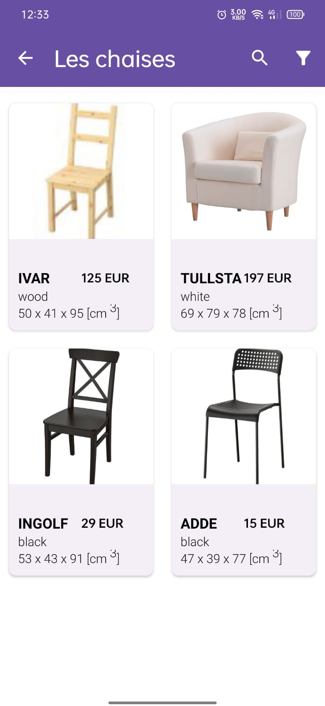

# Fria Furniture in Augmented Reality


<b>Welcome to Fria!</b>


Fria is an augmented reality furniture design planner app similar to [IKEA Place](https://play.google.com/store/apps/details?id=com.ingka.ikea.app&hl=en).
Fria lets you place 3D models in your place.
By utilizing ARCore and Sceneform libraries by google it allows you to visualize how furniture would
 fit to your home without ever going to the shop.


Fria is the final project in the university of Aix Marseille.


## Features
- Measuring real world  location
- Searching furniture with  maximum measumrent # not completed
- Placing 3D model of <b>real furnitures!</b>  at home
- Taking picture/ vidoe of model at your home

## Supported devices

Go to :

[https://developers.google.com/ar/discover/supported-devices](https://developers.google.com/ar/discover/supported-devices)


## Demo


## Screenshots

### Main page searching for plane

### Main page plane discovered

### Furniture Catalog main papge

### Item catalog by category screen

### Item description screen

### The model has been placed!!


## project structure
```
.
├── ar                                      # arcore related logic
│   ├── CameraFacingNode.kt                 # a type of node always facing the camera
│   └── MyArFragment.kt                     # custom arframgent 

├── catalog                                 # contains the catalog screens logic
│   ├── CatalogFrontActivity.kt             # main page of the catalog(the one with the categories)
│   ├── DepartmentActivity.kt               # department page activit
│   ├── DepartmentRecyclerAdapter.kt        # department adapter
│   ├── DepartmentSourceData.kt             # holds the department images
│   ├── ItemDetailsActivity.kt              #  activity showing details about ites.
                                               Also allows downloading a model to show
│   ├── ItemRecyclerAdapter.kt              # recycle adapter for items
│   └── LoadingDialogFragment.kt            # loading aimation fragment
├── Repository                              # contains the repository logic
│   ├── FavoritesRepository.kt              # repository for managing favorite items

├── Room                                    # contains the Room database logic
│   ├── AppDatabase.kt                      # main database configuration and initialization
│   ├── Department.kt                       # data class representing a department
│   ├── FavoritesDao.kt                     # Data Access Object (DAO) interface for favorite items
│   ├── Furniture.kt                        # data class representing a furniture item
├── ViewModel                               # contains the ViewModel logic
│   ├── FavoritesViewModel.kt               # ViewModel for managing favorite items
│
├── utils                                   # utility classes
│   ├── Converters.kt                       # type converters for Room database
│   ├── PhotoSaver.kt                       # saves AR scene photo
│   ├── VideoRecorder.java                  # records AR scene video

├── InfoFAB.kt                              # the infofab shows no the camera activity.Top left panel

├── LoginActivity.kt                        # activity for user login, Manages user authentication using email and password , Displays custom progress dialog during login process

├── MeasurementBox.kt                       # holds logic regearding creating the 3d cube used to measure a reald world 3d sapcec

├── MyFavoritesActivity.kt                  # activity showing the user's favorite items , Uses Groupie for binding RecyclerView items , Interacts with FavoritesViewModel to fetch and display favorite items 

├── LoginActivity.kt                        # activity for user login | Manages user authentication using email and password | Displays custom progress dialog during login process
                                            
├── OpenCameraActivity.kt                   # the main activity.Holds the AR logic

├── SplashActivity.kt                       # splash screen activity | Checks for valid authentication token on startup | Navigates to LoginActivity if token is expired or missing | Otherwise, proceeds to OpenCameraActivity

── Utils.kt                                # Utility class containing constants used across the project

```

## 3D models
Our app uses Firebase as backend.

The models were takes from multiple sources.
They were preprocessed using blender software and uploaded to firebase using python.

### List of 3d models sources
    * https://free3d.com/3d-models/ikea

    * https://www.turbosquid.com/Search/3D-Models/free/ikea

    * https://3dwarehouse.sketchup.com/collection/ue790c74c-6a82-4077-92cd-7f6d2a5f1661/ikea?sortBy=createTime%20DESC&searchTab=model&hl=en&login=true

    * https://www.polantis.com/ikea/arstid-wall-lamp

    
## List of tools used

1. [Blender](https://www.blender.org/) - used to edit/prepare models for ARCore to be displayed

2. [adobe after effects](https://www.adobe.com/il_en/products/aftereffects.html?gclid=Cj0KCQjw8fr7BRDSARIsAK0Qqr48Zn77ZN5bvCHuYUj-A8n33hjqkPH6LINI5eQyFHOb9LtmSKOBRUcaAoBNEALw_wcB&sdid=8DN85NTY&mv=search&skwcid=AL!3085!3!340845921979!e!!g!!adobe%20after%20effects&ef_id=Cj0KCQjw8fr7BRDSARIsAK0Qqr48Zn77ZN5bvCHuYUj-A8n33hjqkPH6LINI5eQyFHOb9LtmSKOBRUcaAoBNEALw_wcB:G:s&s_kwcid=AL!3085!3!340845921979!e!!g!!adobe%20after%20effects!1464058443!56263479985) - used to prepare the instruction videos 

3. [free logo design ](https://editor.freelogodesign.org/?lang=en&logo=2895af34-67d1-42d7-8c42-0ddedb973ba0&companyname=&category=0) - used to create the icon


## Credits
[ABDELLATIF BENBAHA ] Computer science student at Aix Marseille University
University mail : abdellatif.benbaha@etu.univ-amu.fr
id :b21230567
#   p r o j e t - f i n a l e 
 
 
